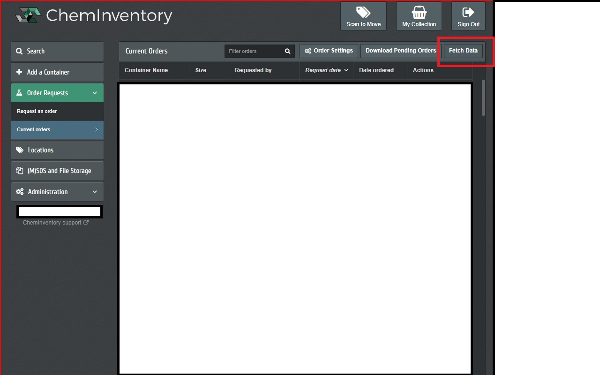

Chrome extension to all download all orders in [ChemInventory](https://www.cheminventory.net/). Currently only allow download pending orders.

**Extension is under review in Chrome Web Store.**

# Screenshot


## Using locally
1. git clone this repository into any location, let say documents folder.

```bash
cd ~/Documents
git clone git@github.com:liongkj/cheminventory_helper.git cheminventory_helper
```

2.  In chrome browser or edge browser
```
chrome://extensions

edge://extensions
```

3. Enable developer mode

4. "Load unpacked" and select the folder you git cloned in step 1. 

Follow the steps here to load the extension locally.

[Steps](https://developer.chrome.com/docs/extensions/get-started/tutorial/hello-world#load-unpacked)


# Disclaimer
This is just a hobby project I did for my friend to understand how chrome extensions work. I am not affiliated with ChemInventory in any way. I am not responsible for any damage caused by this extension. Use at your own risk.

# License
MIT License

# Privacy Policy
[Link](./privacy.md)

This extension does not collect any data from the user. It only downloads the orders from ChemInventory. The source code is available in the repository. Feel free to inspect it.

# Contact
If you have any questions, feel free to contact me at fantasticbabii[at]gmail.com.
